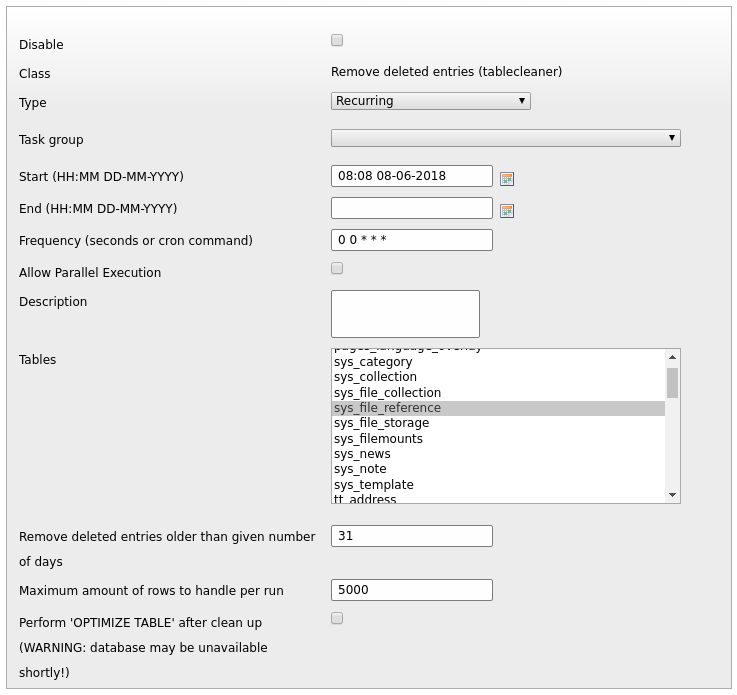
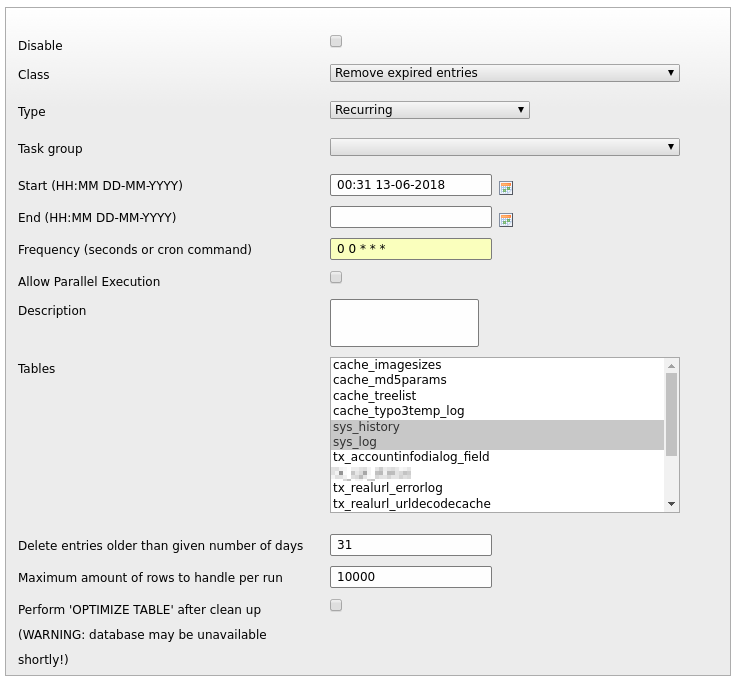
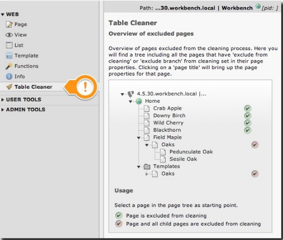

.. ==================================================
.. FOR YOUR INFORMATION
.. --------------------------------------------------
.. -*- coding: utf-8 -*- with BOM.  Check: ÄÖÜäöüß

.. include:: ../Includes.txt

.. _user-manual:

===========
User Manual
===========

In the scheduler you will find three new tasks in the section 'tablecleaner':
- Remove deleted entries
- Remove expired entries
- Remove hidden entries

You can set a retention time in days for each task. If you need different retention times for different tables, just create separate tasks for each table and time combination.

You can find these options in page properties under the visibility section on the 'Access' tab.

There is one exclusion to this rule; when cleaning the pages table, the pages themselves will be excluded from the cleaning process.

You can also recursively exclude pages from the cleaning process.
Remove deleted entries
**********************

In the table cleaner task, you can select one or more tables for cleaning. You can also specify a number of days after which to actually remove the deleted records from the table. The default is 31 days.

If you wish to set different retentions for different tables, you can create multiple scheduler tasks and then specify a different retention time for each task.

Remove hidden entries
*********************
In the remove hidden entries task, you can select one or more tables for cleaning. You can also specify a number of days after which to remove the hidden records from the table. The default is 31 days.

.. figure:: ../Image/TableCleanerRemoveHidden.png
	:alt: Remove hidden entries

Instead of outright deleting the hidden records from the table, the cleaner can mark them as being 'deleted'. If the checkbox 'Mark records as deleted' is checked, the timestamp of the expired records will be touched and the records will be marked as 'deleted'.

This will give another option to build in a 'grace period' for editors that like to 'archive' their unused content by marking it as deleted. When they discover their once hidden records have now vanished from the backend, we can still restore them from the recycle bin.

If you wish to set different retentions for different tables, you can create multiple scheduler tasks and then specify a different retention time for each task.

Remove expired entries
**********************
In the remove expired entries task, you can select one or more tables for cleaning. You can also specify a number of days after which to remove the records from the table. The default is 31 days.

NB! Please note that this task is the most aggressive cleaner since it ignores the deleted and hidden flags and only looks at the 'tstamp' field when removing records.

If you wish to set different retentions for different tables, you can create multiple scheduler tasks and then specify a different retention time for each task.

Overview of excluded pages
**************************
There is a backend module that shows you an overview of what pages and branches are excluded in the TYPO3 page tree or any selected branch.

Clicking on a page title will bring you straight to the page properties of that page.
